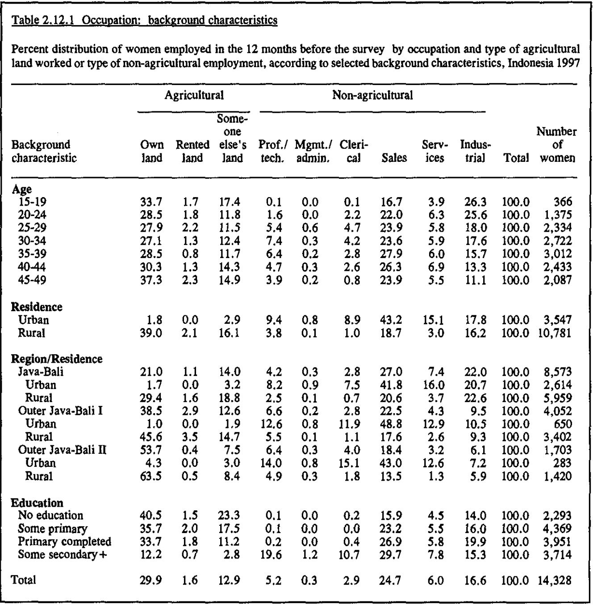

```{r setup, include=FALSE, warning=FALSE}
## Be sure to run 01-gather_data.R and 02-clean_and_prepare_data.R before ##

# Workspace set-up #
library(tidyverse)
library(bookdown)
library(knitr)
library(patchwork)
```

```{r, include=FALSE}
### read in the data ###
data_age <-
read_csv(file = "cleaned_data_age.csv",
         show_col_types = FALSE)

data_education <-
read_csv(file = "cleaned_data_education.csv",
         show_col_types = FALSE)

data_region <-
read_csv(file = "cleaned_data_region.csv",
         show_col_types = FALSE)

data_residence <-
read_csv(file = "cleaned_data_residence.csv",
         show_col_types = FALSE)

data_total <-
read_csv(file = "cleaned_data_total.csv",
         show_col_types = FALSE)
```


```{r, include=FALSE}
## Add agriculture and non-agriculture columns ##

data_age <-
data_age |>
  mutate(agricultural = own_land + rented_land + someone_elses_land,
         non_agricultural = prof_tech + mgmt_admin + clerical + sales + services + industrial)

data_education <-
data_education |>
  mutate(agricultural = own_land + rented_land + someone_elses_land,
         non_agricultural = prof_tech + mgmt_admin + clerical + sales + services + industrial)

data_region <-
data_region |>
  mutate(agricultural = own_land + rented_land + someone_elses_land,
         non_agricultural = prof_tech + mgmt_admin + clerical + sales + services + industrial)

data_residence <-
data_residence |>
  mutate(agricultural = own_land + rented_land + someone_elses_land,
         non_agricultural = prof_tech + mgmt_admin + clerical + sales + services + industrial)

data_total <-
data_total |>
  mutate(agricultural = own_land + rented_land + someone_elses_land,
         non_agricultural = prof_tech + mgmt_admin + clerical + sales + services + industrial)
```


# Introduction

The Republic of Indonesia, which consists of more than 10000 islands, has been growing rapidly economically with its large population and abundant natural resources. To make the most of its great potential, deploying decent policies that can accelerate its growth is essential to catch up with developed countries. Here, data or statistics is a very useful tool to help come up with those policies. However, it is often the case with developing countries that there are few data available compared to the country like U.S. To tackle this problem,  the Demographic and Health Surveys (DHS) Program started.

DHS program, which is funded by U.S. Agency for International Development (USAID), has helped collecting nationally representative data on fertility, family planning, maternal and child health, gender, HIV/AIDS, malaria, and nutrition [@citepdf]. In this paper, I will use the data set from the Indonesia Demographic and Health Survey (IDHS) in 1997, which is a part of DHS program. It contains the data on fertility levels, family planning, maternal and child health services, availability and accessibility of family planning and health services, as well as information on knowledge and attitude toward HIV/AIDS [@citepdf]. The goal of this paper is to grasp the situation regarding occupation that women in Indonesia faced in 1997, and try to make suggestion on public policies using the results of the analysis.

This paper is composed of three sections. First, in Data section, I will look at the dataset about the distribution of women's occupation in Indonesia, with explanations of variables and methodology used by the DHS. Second, in Results section, I will visualize the data using some graphs so that we can understand the features of data. Finally, I will discuss the findings of this paper and provide weaknesses and next steps for further analysis. The analysis for this paper uses the R statistical programming language [@citeR], primarily using the `tidyverse` package for data manipulation [@citetidyverse]. It uses `pdftools` package for parsing the PDF [@citepdftools], and `bookdown` package [@citebookdown] and `knitr` package [@citeknitr] for making a R markdown report .


# Data

## Data and variables

IDHS's final report in 1997 is available at the website of DHS program in PDF format (you can download it [here](https://dhsprogram.com/publications/publication-fr95-dhs-final-reports.cfm)). It contains a number of statistics on population, family planning, and health, which is useful for capturing the whole present situation of the country from various aspects and finding any problem the country facing. This final report is a fourth report out of the similar surveys done in Indonesia, where the first was done in 1987, the second in 1991, and the third in 1994. It covers approximately 29000 respondents of ever-married women age 15-49.

My interest is on the table on page 58 of the report in the PDF format, which is about distribution of women's occupation in Indonesia. The original table in the report is shown in Figure \@ref(fig:table). The table shows the percent distribution of women who worked in the 12 months prior to the survey sorted by background characteristics. The table has four sections, Age, Residence, Region, and Education. However, I omitted the Residence section because it's very similar to the data in Region section. The Region section has three regions, Java-Bali, Outer Java-Bali I, and Outer Java-Bali II, which is divided based on provinces. Java-Bali is composed of DKI Jakarta, West Java, Central Java, DI Yogyakarta, East Java, and Outer Java-Bali has Dista Aceh, North Sumatra, West Sumatra, South Sumatra, Lampung, West Nusa Tanggara, West Kalimantan, South Kalimantan, North Sulawesi, South Sulawesi, and Outer Java-Bali II has Riau, Jambi, Bengkulu, East Nusa Tenggara, East Timor, Central Kalimantan, East Kalimantan, Central Sulawesi, Southeast Sulawesi, Maluku, Irian Jaya, Bali. Looking at the column names, you can find nine occupations. There are three divisions for farmers, who has own land, rented land, someone else's land. Whereas, there are six occupations for non-agricultural sectors, namely professional and technical occupations, manufacturing industries, services, sales, clerical occupations, managerial and administrative jobs.

When parsing the PDF, I divided the table into four sections and created 4 separate dataset. After parsing the PDF and making it usable data, it looks like Table \@ref(tab:datatable).

```{r table, fig.cap = "The table in the IDHS final report", echo=FALSE, fig.align='center', out.width = '95%'}

```
```{r datatable, echo=FALSE, out.width = '80%'}
kable(data_age,
      caption = "The table after parsing the PDF",
      booktabs = TRUE, 
    linesep = "")
```


## Methodology

The Central Bureau of Statistics (CBS) took in charge of executing the survey and processing the data in the 1997 IDHS final report. A survey Steering Committee was established, and they created 86 interview teams, which consists of  284 female interviewers, 86 male field supervisors, and 86 female field editors [@citepdf]. They were trained for 16 days in nine training centers and the field super- visors and editors received additional training in supervisory tasks and editing techniques.

The key feature of this survey is that it was conducted in the form of field work, where interviewers visited the sampled households to ask questionnaires. The 1997 IDHS used three questionnaires: the household questionnaire, the questionnaire on family welfare, and the individual questionnaire for about 29000 ever-married women 15-49 years old. A total of 35,362 households were selected for the survey, of which 34,656 were found. Of the encountered household, 99% were successfully interviewed [@citepdf].

The sample was designed to produce estimates at the national, urban-rural, regional, and provincial levels. In the first stage, census enumeration areas (EAs) were selected systematically with probability proportional to population size. In each EA,segments of approximately 70 contignous households with clear boundaries were formed, and only one segment was selected with a probability proportional to size. In the third stage, 25 households were selected from each segment using a systematic sampling [@citepdf].

The strength of this methodology is that they actually visit households, so that it increase the effect of randomization.  Normally, the respondents of the questionnaires answer it with some voluntarity, but it can cause the bias of the sample. In addition, the procedure of the survey is professional throughout every process as they employed field supervisors and statisticians, and they did decent training on the people involved. Although it is difficult to find weakness of the methodology by IDHS, one thing that can be improved is to publish data in a usable way, such as csv format, because the data is only available on the PDF format, which makes it hard to reproduce them.


# Results

## Total

Figure \@ref(fig:total) shows the distribution of the occupations of women who worked in the 12 months prior to the survey in Indonesia. It shows that many women engage in agriculture, where 44% of women worked in agriculture, among whom seven in ten worked in their own lands. ALso, You can see that outside agricultural sector, sales is a popular choice of job (25%), followed by manufacturing industries (17%), services (6%), and professional and technical occupations (5%).

```{r total, fig.cap = "Distribution of total respondents", fig.width = 5, fig.height = 3, echo = FALSE, message = FALSE, warning = FALSE, fig.align = "center"}
fig_total <-
data_total |>
  pivot_longer(cols = own_land:industrial,
                        names_to = "occupation") |>
  ggplot(aes(x = variable, y = value, fill= factor(occupation, levels = c("residence", "own_land", "rented_land", "someone_elses_land", "prof_tech", "mgmt_admin", "clerical", "sales", "services", "industrial")))) +
  geom_bar(stat = "identity") +
  theme_minimal() +
  scale_fill_brewer(palette = "Spectral") +
  labs(x = "Total",
       y = "Value(%)",
       fill = "Occupation") +
  theme(plot.title = element_text(size=7), 
               axis.text = element_text(size=7),
               axis.title = element_text(size=7),
              legend.title = element_text(size=7),
        legend.text = element_text(size=7),
        legend.key.size = unit(0.3, 'cm')) 

fig_total_agricultural <-
data_total |>
  pivot_longer(cols = c(agricultural, non_agricultural),
                        names_to = "occupation") |>
  ggplot(aes(x = variable, y = value, fill= occupation)) +
  geom_bar(stat = "identity") +
  theme_minimal() +
  scale_fill_brewer(palette = "Spectral") +
  labs(x = "Total",
       y = "Value(%)",
       fill = "Occupation") +
  theme(plot.title = element_text(size=7), 
               axis.text = element_text(size=7),
               axis.title = element_text(size=7),
        legend.title = element_text(size=7),
        legend.text = element_text(size=7),
       legend.key.size = unit(0.3, 'cm')) 

fig_total + fig_total_agricultural
```

## Age

Figure \@ref(fig:age) shows the distribution by age.  It is noted that the proportion of women working for manufacturing industries gradually decreases as they get older. This is probably because it often needs physical labor.

Figure \@ref(fig:ageline) shows the changes in the proportion of agricultural sector to non-agricultural sector by ages. There is a significant trend that the proportion rapidly declined from 15-19 to 20-24, and it remains until 35-39, then it rapidly increases after 40-44. This is probably because they work in farms with their families when they are young, then after becoming adults, they go to city to work in non-agricultural sectors, but they return to their home and work their after they get pregnant, married, or retired.

```{r age, fig.cap = "Distribution of occupation by Age", fig.width = 5, fig.height = 3, echo = FALSE, message = FALSE, warning = FALSE, fig.align = "center"}
data_age |>
  pivot_longer(cols = own_land:industrial,
                        names_to = "occupation") |>
  ggplot(aes(x = age, y = value, fill= factor(occupation, levels = c("residence", "own_land", "rented_land", "someone_elses_land", "prof_tech", "mgmt_admin", "clerical", "sales", "services", "industrial")))) + 
  geom_bar(stat = "identity") +
  theme_minimal() +
    scale_fill_brewer(palette = "Spectral") +
  labs(x = "Age group",
       y = "Value(%)",
       fill = "Occupation") +
  theme(plot.title = element_text(size=7), 
               axis.text = element_text(size=7),
               axis.title = element_text(size=7),
        legend.title = element_text(size=7),
        legend.text = element_text(size=7),
       legend.key.size = unit(0.3, 'cm')) 
```

```{r ageline, fig.cap = "Change in the proportion of agriculture", fig.width = 5, fig.height = 3, echo = FALSE, message = FALSE, warning = FALSE, fig.align = "center"}
data_age |>
  pivot_longer(cols = c(agricultural, non_agricultural),
                        names_to = "occupation") |>
  ggplot(aes(x = age,  y= value, color = occupation, group = occupation)) +
  geom_line() +
    labs(x = "Age",
       y = "Value(%)",
       color = "Occupation type") +
  theme(plot.title = element_text(size=7), 
               axis.text = element_text(size=7),
               axis.title = element_text(size=7),
        legend.title = element_text(size=7),
        legend.text = element_text(size=7),
       legend.key.size = unit(0.3, 'cm')) 
```


## Education

Figure \@ref(fig:age) shows the distribution by age, in which you can see a few strong trends. The proportion of agricultural sector gradually declines as the educational level gets higher, where it declines from 65.7% for women with no education to 15.7% with some secondary+ education. Also, within agricultural sector, the proportion of those who have their own lands is getting higher as the educational level. It is also noted that professional and technical occupations is limited only for people with some secondary+ education.

```{r education, fig.cap = "Distribution of occupation by Education", fig.width = 5, fig.height = 3, echo = FALSE, message = FALSE, warning = FALSE, fig.align = "center"}
data_education |>
  pivot_longer(cols = own_land:industrial,
                        names_to = "occupation") |>
  ggplot(aes(x = factor(education, levels = c("no_education", "some_primary", "primary_completed", "some_secondary+")), y = value, fill= factor(occupation, levels = c("residence", "own_land", "rented_land", "someone_elses_land", "prof_tech", "mgmt_admin", "clerical", "sales", "services", "industrial")))) +
  geom_bar(stat = "identity") +
  theme_minimal() +
  scale_fill_brewer(palette = "Spectral") +
  labs(x = "Education level",
       y = "Value(%)",
       fill = "Occupation") +
  theme(plot.title = element_text(size=7), 
               axis.text = element_text(size=7),
               axis.title = element_text(size=7),
        legend.title = element_text(size=7),
        legend.text = element_text(size=7),
       legend.key.size = unit(0.3, 'cm')) 
```
## Region

Figure \@ref(fig:region) shows the distribution of occupation sorted by three region, Java-bali, Outer Java-bali I, Outer Java-bali II. Basically, the more rural the region is, the more people working for agriculture. Therefore, if you compare those 3 regions, we can expect that Outer Java-bali II is most rural, followed by Outer Java-bali I, and Java-bali. In addition, comparing urban and rural areas within the regions, it shows that less people works for agriculture and more people works in service or sales occupations in urban areas. As a result, we can conclude that the relation between urban and rural areas is similar to one between people with little and high educational backgrounds.

```{r region, fig.cap = "Distribution of occupation by Region", fig.width = 5, fig.height = 9, echo = FALSE, message = FALSE, warning = FALSE, fig.align = "center"}

region_1 <-
data_region |>
  slice(1:3) |>
  pivot_longer(cols = own_land:industrial,
                        names_to = "occupation") |>
  ggplot(aes(x = region, y = value, fill= factor(occupation, levels = c("residence", "own_land", "rented_land", "someone_elses_land", "prof_tech", "mgmt_admin", "clerical", "sales", "services", "industrial")))) +
  geom_bar(stat = "identity") +
  theme_minimal() +
  scale_fill_brewer(palette = "Spectral") +
  labs(x = "Region",
       y = "Value(%)",
       fill = "Occupation") +
  theme(plot.title = element_text(size=7), 
               axis.text = element_text(size=7),
               axis.title = element_text(size=7),
        legend.title = element_text(size=7),
        legend.text = element_text(size=7),
       legend.key.size = unit(0.3, 'cm')) 

region_2 <-
data_region |>
  slice(4:6) |>
  pivot_longer(cols = own_land:industrial,
                        names_to = "occupation") |>
  ggplot(aes(x = region, y = value, fill= factor(occupation, levels = c("residence", "own_land", "rented_land", "someone_elses_land", "prof_tech", "mgmt_admin", "clerical", "sales", "services", "industrial")))) +
  geom_bar(stat = "identity") +
  theme_minimal() +
  scale_fill_brewer(palette = "Spectral") +
  labs(x = "Region",
       y = "Value(%)",
       fill = "Occupation") +
  theme(plot.title = element_text(size=7), 
               axis.text = element_text(size=7),
               axis.title = element_text(size=7),
        legend.title = element_text(size=7),
        legend.text = element_text(size=7),
       legend.key.size = unit(0.3, 'cm')) 

region_3 <-
data_region |>
  slice(7:9) |>
  pivot_longer(cols = own_land:industrial,
                        names_to = "occupation") |>
  ggplot(aes(x = region, y = value, fill= factor(occupation, levels = c("residence", "own_land", "rented_land", "someone_elses_land", "prof_tech", "mgmt_admin", "clerical", "sales", "services", "industrial")))) +
  geom_bar(stat = "identity") +
  theme_minimal() +
  scale_fill_brewer(palette = "Spectral") +
  labs(x = "Region",
       y = "Value(%)",
       fill = "Occupation") +
  theme(plot.title = element_text(size=7), 
               axis.text = element_text(size=7),
               axis.title = element_text(size=7),
        legend.title = element_text(size=7),
        legend.text = element_text(size=7),
       legend.key.size = unit(0.3, 'cm')) 

region_1 / region_2 / region_3

```

# Discussion

By analyzing the data, I observe various trends discussed in the Results section in each type of data, age, education, and region. The weaknesses of this paper are using data about only women and the fact that the data about occupation is hard to discuss because it is hard to find problematic things that can be useful for policy making.


\appendix


# Appendix {-}

# Datasheet

**Motivation**

1. *For what purpose was the dataset created? Was there a specific task in mind? Was there a specific gap that needed to be filled? Please provide a description.*
    - The dataset was created to provide policy makers and program managers in population and health in Indonesia with detailed information on fertility, infant and child mortality, family planning, and maternal and child health.
2. *Who created the dataset (for example, which team, research group) and on behalf of which entity (for example, company, institution, organization)?*
    - The dataset was created by the Central Bureau of Statistics at the request of the State Ministry for Population/National Family Planning Coordinating Board (NFPCB). Since 1991, the Ministry of Health collaborated at all stages of the projects.
3. *Who funded the creation of the dataset? If there is an associated grant, please provide the name of the grantor and the grant name and number.*
    - All of the local costs for the survey were provided by the Government of Indonesia through the NFPCB development budget.
4. *Any other comments?*
    - None

**Composition**

1. *What do the instances that comprise the dataset represent (for example, documents, photos, people, countries)? Are there multiple types of instances (for example, movies, users, and ratings; people and interactions between them; nodes and edges)? Please provide a description.*
	- The instances represent the regions of Indonesia, age groups, educational levels.
2. *How many instances are there in total (of each type, if appropriate)?*
	- 7 for age group, 9 for region, 4 for educational levels.
3. *Does the dataset contain all possible instances or is it a sample (not necessarily random) of instances from a larger set? If the dataset is a sample, then what is the larger set? Is the sample representative of the larger set (for example, geographic coverage)? If so, please describe how this representativeness was validated/verified. If it is not representative of the larger set, please describe why not (for example, to cover a more diverse range of instances, because instances were withheld or unavailable).*
	- The dataset only contains the data of women, so the data of men can be a possible instance. Apart from that, the regions of Indonesia, and educational levels seems to contain all possible instances, while age groups only include people of 15-49 years old.
4. *What data does each instance consist of? "Raw" data (for example, unprocessed text or images) or features? In either case, please provide a description.*
	- Each instance consists of 11 continuous variables (raw data).
5. *Is there a label or target associated with each instance? If so, please provide a description.*
	- The first column of each instance represents the background characteristic of women.
6. *Is any information missing from individual instances? If so, please provide a description, explaining why this information is missing (for example, because it was unavailable). This does not include intentionally removed information, but might include, for example, redacted text.*
	- No
7. *Are relationships between individual instances made explicit (for example, users' movie ratings, social network links)? If so, please describe how these relationships are made explicit.*
	- There are some relationships within the same type of instances. For example, age group of 15-19 and 20-24 is related in that they are young.
8. *Are there recommended data splits (for example, training, development/validation, testing)? If so, please provide a description of these splits, explaining the rationale behind them.*
	- There are no recommended data splits.
9. *Are there any errors, sources of noise, or redundancies in the dataset? If so, please provide a description.*
	- There are no errors, sources of noise, or redundancies in the dataset.
10. *Is the dataset self-contained, or does it link to or otherwise rely on external resources (for example, websites, tweets, other datasets)? If it links to or relies on external resources, a) are there guarantees that they will exist, and remain constant, over time; b) are there official archival versions of the complete dataset (that is, including the external resources as they existed at the time the dataset was created); c) are there any restrictions (for example, licenses, fees) associated with any of the external resources that might apply to a dataset consumer? Please provide descriptions of all external resources and any restrictions associated with them, as well as links or other access points, as appropriate.*
	- The dataset is self-contained.
11. *Does the dataset contain data that might be considered confidential (for example, data that is protected by legal privilege or by doctor-patient confidentiality, data that includes the content of individuals' non-public communications)? If so, please provide a description.*
	-  There is no confidential data, and the dataset is publicly available.
12. *Does the dataset contain data that, if viewed directly, might be offensive, insulting, threatening, or might otherwise cause anxiety? If so, please describe why.*
	- It doesn't contain data that might be offensive, insulting, threatening, or might otherwise cause anxiety.
13. *Does the dataset identify any sub-populations (for example, by age, gender)? If so, please describe how these subpopulations are identified and provide a description of their respective distributions within the dataset.*
	- The dataset is composed of ever-married women age 15-49.
14. *Is it possible to identify individuals (that is, one or more natural persons), either directly or indirectly (that is, in combination with other data) from the dataset? If so, please describe how.*
	- It is not possible to identify individuals.
15. *Does the dataset contain data that might be considered sensitive in any way (for example, data that reveals race or ethnic origins, sexual orientations, religious beliefs, political opinions or union memberships, or locations; financial or health data; biometric or genetic data; forms of government identification, such as social security numbers; criminal history)? If so, please provide a description.*
	- No, it doesn't.
16. *Any other comments?*
	- None

**Collection process**

1. *How was the data associated with each instance acquired? Was the data directly observable (for example, raw text, movie ratings), reported by subjects (for example, survey responses), or indirectly inferred/derived from other data (for example, part-of-speech tags, model-based guesses for age or language)? If the data was reported by subjects or indirectly inferred/derived from other data, was the data validated/verified? If so, please describe how.*
	- 
2. *What mechanisms or procedures were used to collect the data (for example, hardware apparatuses or sensors, manual human curation, software programs, software APIs)? How were these mechanisms or procedures validated?*
	- 
3. *If the dataset is a sample from a larger set, what was the sampling strategy (for example, deterministic, probabilistic with specific sampling probabilities)?*
	- 
4. *Who was involved in the data collection process (for example, students, crowdworkers, contractors) and how were they compensated (for example, how much were crowdworkers paid)?*
	- 
5. *Over what timeframe was the data collected? Does this timeframe match the creation timeframe of the data associated with the instances (for example, recent crawl of old news articles)? If not, pleae describe the timeframe in which the data associated with the instances was created.*
	- 
6. *Were any ethical review processes conducted (for example, by an institutional review board)? If so, please provide a description of these review processes, including the outcomes, as well as a link or other access point to any supporting documentation.*
	- 
7. *Did you collect the data from the individuals in question directly, or obtain it via third parties or other sources (for example, websites)?*
	- 
8. *Were the individuals in question notified about the data collection? If so, please describe (or show with screenshots or other information) how notice was provided, and provide a link or other access point to, or otherwise reproduce, the exact language of the notification itself.*
	- 
9. *Did the individuals in question consent to the collection and use of their data? If so, please describe (or show with screenshots or other information) how consent was requested and provided, and provide a link or other access point to, or otherwise reproduce, the exact language to which the individuals consented.*
	- 
10. *If consent was obtained, were the consenting individuals provided with a mechanism to revoke their consent in the future or for certain uses? If so, please provide a description, as well as a link or other access point to the mechanism (if appropriate).*
	- 
11. *Has an analysis of the potential impact of the dataset and its use on data subjects (for example, a data protection impact analysis) been conducted? If so, please provide a description of this analysis, including the outcomes, as well as a link or other access point to any supporting documentation.*
	- 
12. *Any other comments?*
	- 

**Preprocessing/cleaning/labeling**

1. *Was any preprocessing/cleaning/labeling of the data done (for example, discretization or bucketing, tokenization, part-of-speech tagging, SIFT feature extraction, removal of instances, processing of missing values)? If so, please provide a description. If not, you may skip the remaining questions in this section.*
	- 
2. *Was the "raw" data saved in addition to the preprocessed/cleaned/labeled data (for example, to support unanticipated future uses)? If so, please provide a link or other access point to the "raw" data.*
	- 
3. *Is the software that was used to preprocess/clean/label the data available? If so, please provide a link or other access point.*
	- 
4. *Any other comments?*
	- 

**Uses**

1. *Has the dataset been used for any tasks already? If so, please provide a description.*
	- 
2. *Is there a repository that links to any or all papers or systems that use the dataset? If so, please provide a link or other access point.*
	- https://github.com/haqbilal/India-1992-DHS-State-Findings/blob/main/outputs/paper/paper.Rmd
3. *What (other) tasks could the dataset be used for?*
	- 
4. *Is there anything about the composition of the dataset or the way it was collected and preprocessed/cleaned/labeled that might impact future uses? For example, is there anything that a dataset consumer might need to know to avoid uses that could result in unfair treatment of individuals or groups (for example, stereotyping, quality of service issues) or other risks or harms (for example, legal risks, financial harms)? If so, please provide a description. Is there anything a dataset consumer could do to mitigate these risks or harms?*
	- 
5. *Are there tasks for which the dataset should not be used? If so, please provide a description.*
	- 
6. *Any other comments?*
	- 

**Distribution**

1. *Will the dataset be distributed to third parties outside of the entity (for example, company, institution, organization) on behalf of which the dataset was created? If so, please provide a description.*
	- TBD
2. *How will the dataset be distributed (for example, tarball on website, API, GitHub)? Does the dataset have a digital object identifier (DOI)?*
	- TBD
3. *When will the dataset be distributed?*
	- TBD
4. *Will the dataset be distributed under a copyright or other intellectual property (IP) license, and/or under applicable terms of use (ToU)? If so, please describe this license and/ or ToU, and provide a link or other access point to, or otherwise reproduce, any relevant licensing terms or ToU, as well as any fees associated with these restrictions.*
	- TBD
5. *Have any third parties imposed IP-based or other restrictions on the data associated with the instances? If so, please describe these restrictions, and provide a link or other access point to, or otherwise reproduce, any relevant licensing terms, as well as any fees associated with these restrictions.*
	- TBD
6. *Do any export controls or other regulatory restrictions apply to the dataset or to individual instances? If so, please describe these restrictions, and provide a link or other access point to, or otherwise reproduce, any supporting documentation.*
	- TBD
7. *Any other comments?*
	- TBD

**Maintenance**

1. *Who will be supporting/hosting/maintaining the dataset?*
	- TBD
2. *How can the owner/curator/manager of the dataset be contacted (for example, email address)?*
	- TBD
3. *Is there an erratum? If so, please provide a link or other access point.*
	- TBD
4. *Will the dataset be updated (for example, to correct labeling errors, add new instances, delete instances)? If so, please describe how often, by whom, and how updates will be communicated to dataset consumers (for example, mailing list, GitHub)?*
	- TBD
5. *If the dataset relates to people, are there applicable limits on the retention of the data associated with the instances (for example, were the individuals in question told that their data would be retained for a fixed period of time and then deleted)? If so, please describe these limits and explain how they will be enforced.*
	- TBD
6. *Will older versions of the dataset continue to be supported/hosted/maintained? If so, please describe how. If not, please describe how its obsolescence will be communicated to dataset consumers.*
	- TBD
7. *If others want to extend/augment/build on/contribute to the dataset, is there a mechanism for them to do so? If so, please provide a description. Will these contributions be validated/verified? If so, please describe how. If not, why not? Is there a process for communicating/distributing these contributions to dataset consumers? If so, please provide a description.*
	- TBD
8. *Any other comments?*
	- TBD


# References


